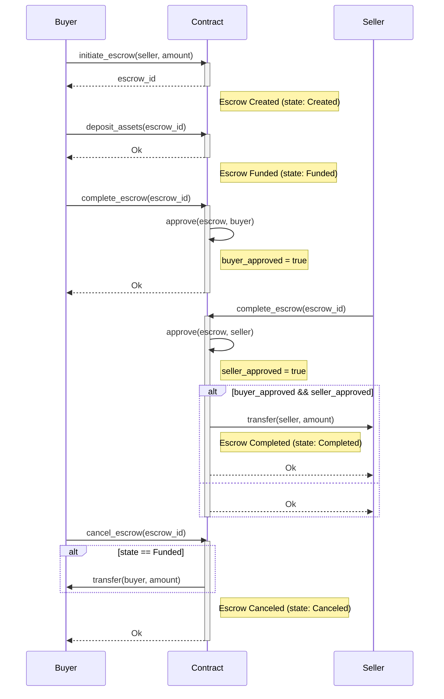

# EscrowSmartContract

```mermaid
sequenceDiagram
    participant B as Buyer
    participant C as Contract
    participant S as Seller

    B->>C: initiate_escrow(seller, amount)
    activate C
    C-->>B: escrow_id
    deactivate C
    Note right of C: Escrow Created (state: Created)

    B->>C: deposit_assets(escrow_id)
    activate C
    C-->>B: Ok
    deactivate C
    Note right of C: Escrow Funded (state: Funded)

    B->>C: complete_escrow(escrow_id)
    activate C
    C->>C: approve(escrow, buyer)
    Note right of C: buyer_approved = true
    C-->>B: Ok
    deactivate C

    S->>C: complete_escrow(escrow_id)
    activate C
    C->>C: approve(escrow, seller)
    Note right of C: seller_approved = true
    alt buyer_approved && seller_approved
        C->>S: transfer(seller, amount)
        Note right of C: Escrow Completed (state: Completed)
        C-->>S: Ok
    else
        C-->>S: Ok
    end
    deactivate C

    B->>C: cancel_escrow(escrow_id)
    activate C
    alt state == Funded
        C->>B: transfer(buyer, amount)
    end
    Note right of C: Escrow Canceled (state: Canceled)
    C-->>B: Ok
    deactivate C
```